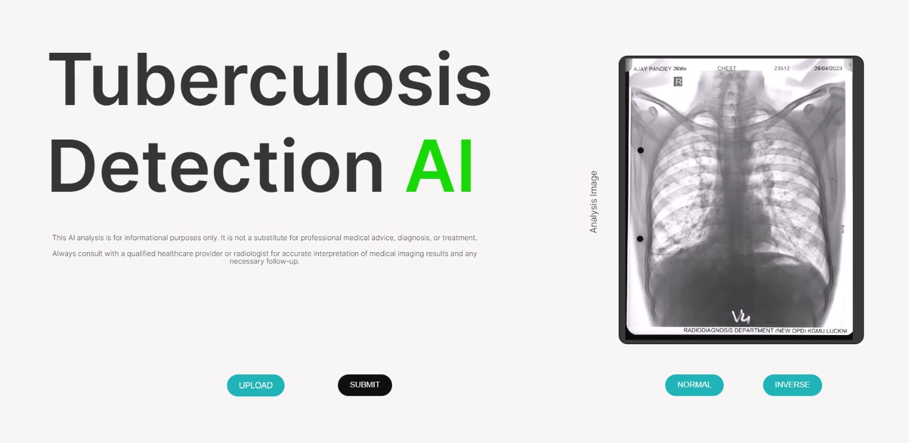
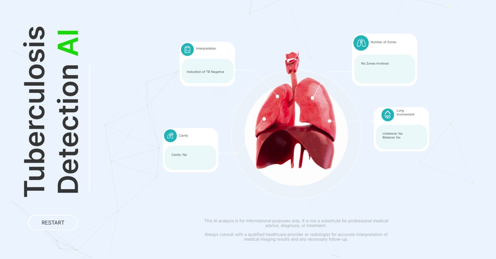

# Tuberculosis Detection AI Project

## Overview

This project aims to develop an AI-based system for the detection of Tuberculosis (TB) in chest X-ray images. Tuberculosis is a contagious bacterial infection that primarily affects the lungs and can be life-threatening if not diagnosed and treated early. The goal of this project is to assist healthcare professionals in the early detection of TB through automated image analysis.

## Features

- Automated classification of chest X-ray images into TB-positive or TB-negative categories.
- User-friendly web application for uploading and analyzing X-ray images.
- Monitoring and alerting to ensure system health and performance.

## Technologies Used

- Python
- TensorFlow for AI model development
- FastAPI for the web application
- Prometheus and Grafana for monitoring

## Getting Started

### Prerequisites

- Python (3.x)
- Git
- Prometheus and Grafana (if setting up monitoring)

### Installation

1. Clone this repository to your local machine:

   ```shell
   git clone https://github.com/ssheikhorg/tuberculosis-detection.git
   cd TuberculosisAI
   ```

2. Develop a simplified TB detection AI model using Python and TensorFlow/Keras:

   ```shell
   python tb_detection_model.py
   ```

3. Build and run the Docker container:

   ```shell
   python -m pip install -r requirements.txt
   python main.py
   ```

4. Access the web application at http://localhost:5000

## Screenshots





## Usage

1. Upload a chest X-ray image through the web application.
2. Wait for the AI model to process the image.
3. View the classification result (TB-positive or TB-negative) on the web interface.
